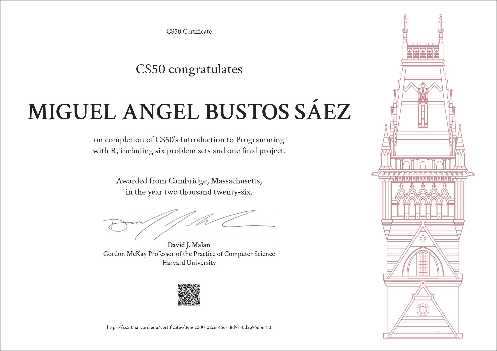

Diseñé una simulación de packete de R llamada "regessiondata", que tiene tres funciones y dos argumentos cada f(x), una de las funciones es economy(), donde presenté una demo el cuál al argumentar con country = "Chile", y argumentar con el año, year = 2023, aparecen datos fidedignos con un data delivery desde el Banco Mundial Internacional, ya que la API de ese banco fué agregada en la arquitectura del paquete de R "regressiondata".

Demostré igualmente en el video que es totalmente funcionable con pipe de tidyverse y ggplot2, donde también con la f(x) economy(), llamé a U.S.A., el mismo año 2023, para hacer un histograma y ver las comparativas, considerando la variable target el gross domestic product o producto interno bruto, donde el GDP de U.S.A es significativamente y altamente deferenciador sobre Chile según la visualización al finalizar la demo.

Como nota, el PIB más alto que ha alcanzado nuestro país Chile fue el 2023.

/I designed an R package simulation called "regressiondata," which has three functions and two arguments each, f(x). One of the functions is economy(), where I presented a demo. When using country = "Chile" and year = 2023, reliable data appears, delivered from the World Bank, as the World Bank's API was integrated into the architecture of the R package "regressiondata."

I also demonstrated in the video that it is fully functional with tidyverse pipes and ggplot2. Using f(x) economy(), I called the U.S.A. for the same year, 2023, to create a histogram and compare the data, considering the target variable as gross domestic product (GDP). The visualization at the end of the demo shows that the U.S. GDP is significantly and highly differentiating compared to Chile./

[📄 Descargar Certificado Oficial en PDF](./certificate/CS50R.pdf)

The other two functions in the R package are politics() and religion(), both of which can be associated with all countries, obtain data and create graphs with other R packages, forecasts and simulations of infinite data regressions.

Las otras dos funciones del paquuete de R, son politics() y religion(), que ambas pueden ser asociadas a todos los países, obtener datos y realizar gráficas con otros paquetes de R, pronósticos y simulaciones de regresiones de datos infinitas.

ing.mig.bustos@gmail.com
